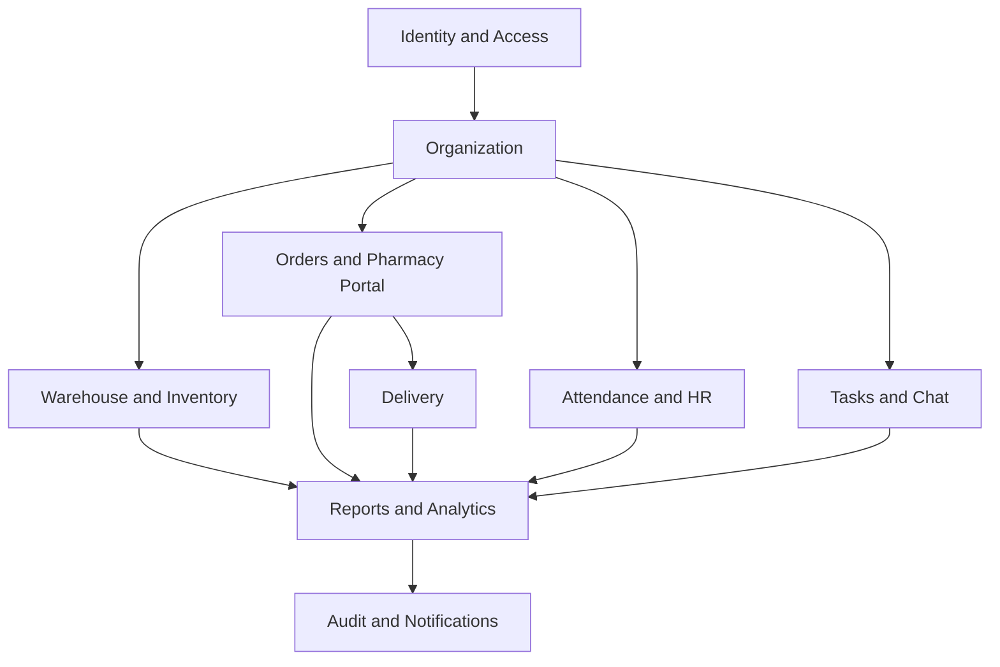
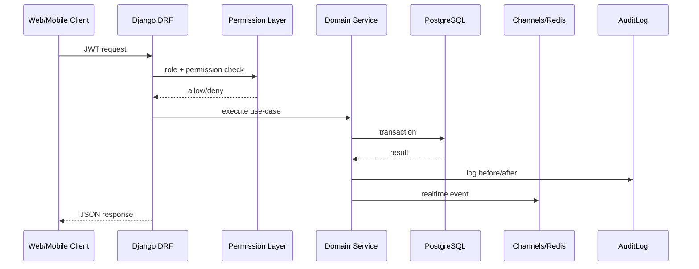

# Backend Architecture

## Stack

- Python
- Django
- Django REST Framework
- PostgreSQL
- Redis
- Channels / WebSocket
- DRF Spectacular
- APScheduler
- On-prem Docker deployment

## Current backend structure

`backend/apps/` ichida domain-oriented modular arxitektura ishlatilgan:

- `accounts`
- `companies`
- `rbac`
- `medicines`
- `warehouse`
- `inventory`
- `pharmacies`
- `orders`
- `delivery`
- `attendance`
- `tasks`
- `chat`
- `notifications`
- `reports`
- `audit_logs`

## Architectural style

### 1. Modular monolith

MVP va on-prem enterprise rollout uchun eng to‘g‘ri yondashuv — **modular monolith**.

Sabablar:

- multi-company logika markazlashgan bo‘ladi
- audit va finance uchun ACID tranzaksiyalar muhim
- on-prem deployment’da operatsion soddalik zarur
- dastlabki bosqichda microservice’dan ko‘ra kuzatish va support osonroq

### 2. Bounded contexts

## Request lifecycle

## Core backend layers

### API layer

Joylashuvi:
- `views.py`
- `serializers.py`
- `urls.py`

Mas'uliyati:
- authentication
- authorization
- validation
- pagination/filter/sort
- response formatting

### Domain layer

Joylashuvi:
- `models.py`
- model methods
- manager methods
- utility modules

Mas'uliyati:
- FEFO picking
- order status transitions
- attendance check-in/check-out rules
- delivery status lifecycle
- notification triggers

### Infrastructure layer

Joylashuvi:
- `config/settings.py`
- `config/asgi.py`
- `nginx/`
- `docker-compose.yml`

Mas'uliyati:
- env config
- WebSocket routing
- static/media handling
- reverse proxy
- runtime orchestration

## Tenant isolation pattern

### Mandatory query scoping

Har bir `ViewSet` quyidagi pattern’dan foydalanishi kerak:

1. `superadmin` — unrestricted
2. `admin` — `company_id=request.user.company_id`
3. branch user — `branch_id=request.user.branch_id`
4. pharmacy — faqat o‘z profile yoki o‘z order/delivery’lari
5. driver — faqat assigned delivery/task

### Recommended hardening

Kelgusi iteratsiya uchun:

- `TenantScopedQuerySet`
- `TenantScopedViewSet`
- global `CurrentTenantMiddleware`
- report/export service’da forced tenant filters

## Realtime design

### Channels events

Hozirgi ASGI config quyidagilarni ko‘rsatadi:

- `/ws/notifications/`
- `/ws/chat/:room_id/`
- `/ws/delivery/:delivery_id/`

### Redis responsibilities

- channel layer broker
- websocket fanout
- cache
- background queue broker (recommended next step)

## Key business workflows

### FEFO picking

1. order confirmed
2. pick order generated
3. stock manager candidate batch'larni topadi
4. earliest expiry first tanlanadi
5. reserve → pick → movement log yaratiladi
6. delivery record ochiladi

### Attendance

1. mobile GPS/selfie/device info yuboradi
2. geofence tekshiriladi
3. shift timing bilan solishtiriladi
4. record yaratiladi
5. daily session summary qayta hisoblanadi
6. audit log yoziladi

### Delivery

1. order → delivery
2. courier assignment
3. location updates via API / WebSocket
4. status progression
5. pharmacy notification
6. location history analytics

## Security architecture

- JWT access token
- refresh token rotation
- RBAC via `rbac` app
- audit trail via `audit_logs`
- WebSocket token auth middleware
- device token registry for push
- 2FA ready extension point recommended

## Recommended next backend hardening

1. Add `CACHES` + `CHANNEL_LAYERS` to `settings.py`
2. Add Celery worker/beat for:
   - expiry alerts
   - report generation
   - telegram/push delivery
   - recall jobs
3. Add service objects for:
   - recall execution
   - procurement workflow
   - finance journal posting
4. Add row-level tenant mixins
5. Add metrics endpoint and Prometheus instrumentation
