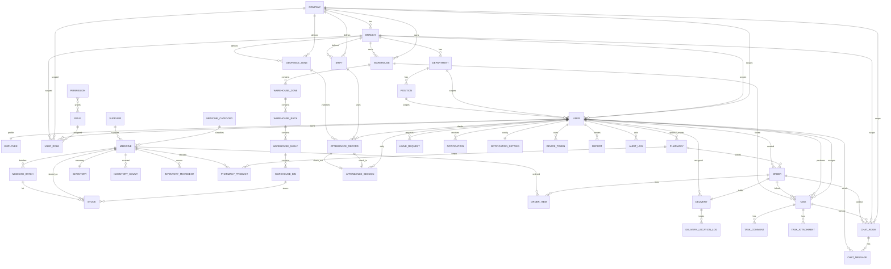

# ERD Diagram

## ERD notes

- Tenant root: `COMPANY`
- Operational scope: `BRANCH`, `WAREHOUSE`
- Security scope: `USER_ROLE`
- FEFO traceability root: `MEDICINE_BATCH` + `STOCK`
- Delivery telemetry root: `DELIVERY_LOCATION_LOG`
- Audit root: `AUDIT_LOG`
