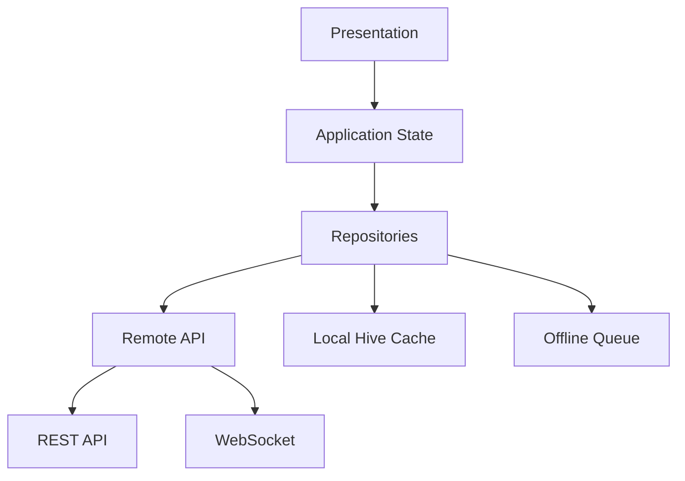

# Flutter Architecture

## Stack

- Flutter
- Riverpod / provider-based state
- Dio
- GoRouter
- Hive
- WebSocket
- Flutter Map
- Offline queue services

## Current mobile reality

`mobile/lib/` ichida quyidagilar mavjud:

- `core/cache/`
- `core/connectivity/`
- `core/router/`
- `core/theme/`
- `data/api/`
- `data/providers/`
- `features/attendance/`
- `features/auth/`
- `features/chat/`
- `features/dashboard/`
- `features/delivery/`
- `features/warehouse/`

Bu enterprise mobile foundation uchun to‘g‘ri yo‘nalish.

## Target app split

Bir kod bazadan 3 operational experience:

1. **Admin APK**
2. **Warehouse APK**
3. **Driver APK**

Role-based navigation orqali bitta binary’da boshqarish mumkin.

## Architectural layers

## Feature modules

### Auth
- splash
- login
- forgot password
- biometric unlock
- token refresh

### Warehouse
- scan QR/barcode
- stock lookup
- inventory count
- pick order
- movements
- attendance

### Driver
- assigned deliveries
- route map
- delivery detail
- status update
- realtime location
- attendance
- chat

### Admin mobile
- dashboard
- orders summary
- live map
- chat
- notifications
- reports summary

## Offline-first rules

### Cache locally
- auth/session metadata
- dictionaries
- assigned tasks
- assigned deliveries
- scanned inventory records
- unsynced attendance events
- unsynced GPS pings

### Queue locally
- attendance check-in/check-out
- delivery status change
- location update
- scan result
- inventory count delta
- chat draft with retry metadata

### Sync rules
1. network available bo‘lsa immediate sync
2. network yo‘q bo‘lsa Hive queue’ga yozish
3. reconnect bo‘lsa FIFO sync
4. conflict bo‘lsa server wins + conflict log
5. critical writes uchun retry/backoff

## Security on mobile

- secure token storage
- biometric unlock
- device token registration
- device binding ready
- screenshot restriction for sensitive screens (recommended)
- offline data encryption (recommended next step)

## Navigation model

Role config fayli mavjud: `mobile/lib/core/config/role_config.dart`

Recommended navigation shell:
- dashboard
- primary role tabs
- secondary feature routes
- notification center
- profile/settings

## Maps

- `flutter_map`
- OpenStreetMap tiles
- OSRM for routing
- Nominatim for geocoding

## Mobile performance rules

- light payload DTOs
- paginated list APIs
- image compression before upload
- GPS batching for delivery history
- lazy-load heavy map layers
- Hive box split by feature

## Recommended next hardening

1. Replace generic provider layer with Bloc/Cubit per feature if strict architecture is required
2. Add sync status center UI
3. Add conflict resolution log screen
4. Add background location policy manager
5. Add crash-safe upload retry manager
