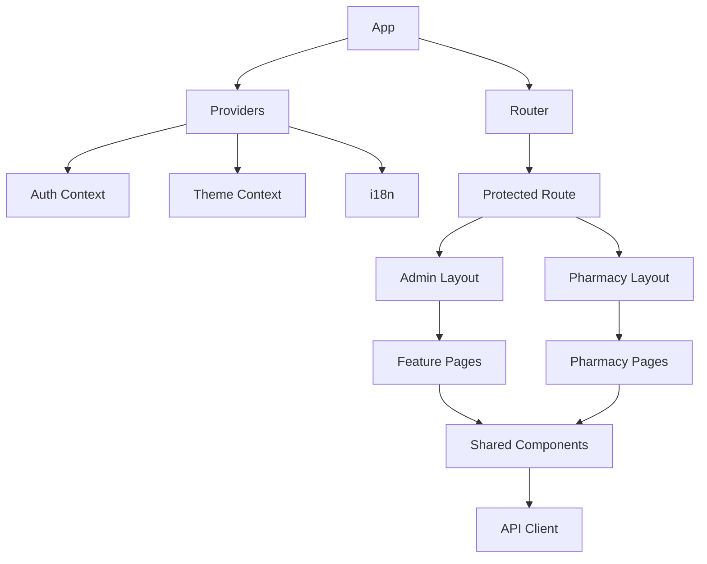

# Frontend Architecture

## Stack

- React 18
- Vite
- React Router
- Tailwind CSS
- i18next
- Recharts
- Radix UI
- Axios
- Leaflet / React-Leaflet

## Current web structure

`frontend/src/` allaqachon enterprise admin portal va pharmacy portal sifatida ajratilgan:

- `components/`
- `context/`
- `hooks/`
- `i18n/`
- `pages/`
- `lib/`

## Application zones

### 1. Corporate web app

Foydalanuvchilar:
- Super Admin
- Admin
- Operator
- Finance

Asosiy route'lar:
- `/dashboard`
- `/medicines`
- `/inventory`
- `/warehouse/*`
- `/reports`
- `/audit-logs`
- `/tasks`
- `/attendance`
- `/chat`
- `/roles`

### 2. Pharmacy portal

Alohida layout bilan ishlaydi:
- `/pharmacy/dashboard`
- `/pharmacy/catalog`
- `/pharmacy/cart`
- `/pharmacy/orders`
- `/pharmacy/notifications`
- `/pharmacy/profile`

## Recommended frontend architecture



## Recommended folder discipline

```text
frontend/src/
  app/
    router/
    providers/
  modules/
    auth/
    dashboard/
    companies/
    warehouse/
    inventory/
    orders/
    delivery/
    attendance/
    reports/
    chat/
  components/
    ui/
    forms/
    layout/
  services/
    api/
    websocket/
  store/
  i18n/
  styles/
```

## State strategy

### Local UI state
- modal state
- table column state
- filters
- search query

### App state
- auth session
- current tenant/company
- selected branch/warehouse
- theme
- locale
- permissions

### Server state
Tavsiya:
- React Query / TanStack Query qo‘shish

Nima uchun:
- cache
- background refetch
- optimistic updates
- mutation invalidation
- offline tolerance improvements

## UI patterns

### Layout
- left navigation
- top command bar
- page header + action group
- KPI cards
- analytic chart strip
- data grid section
- right-side drawer / modal workflows

### Table pattern
Har bir major modul uchun:
- search
- filters
- column visibility
- export
- bulk action
- detail drawer
- audit trail quick link

### Dashboard pattern
- company/branch switcher
- KPI cards
- alerts rail
- chart grid
- task inbox
- delivery live map widget
- expiring batches widget

## I18n

Repo’da:
- `frontend/src/i18n/locales/uz.json`
- `frontend/src/i18n/locales/ru.json`
- `frontend/src/i18n/locales/en.json`

Translation priority:
1. Uzbek
2. Russian
3. English

## Design implementation notes

Mavjud CSS Apple + Linear + glassmorphism’ga yaqin:
- `glass`
- `glass-card`
- `glass-sidebar`
- `glass-header`

Dark mode primary bo‘lib qolishi kerak.

## Web permissions UX

- route guard
- menu visibility by permission
- action button enable/disable by permission
- export buttons only when `export_*`
- approval buttons faqat `approve_*`

## Recommended next enhancements

1. Move from context-only to feature modules
2. Add query cache layer
3. Add websocket hooks for notifications/chat/delivery
4. Add tenant switch shell for superadmin
5. Add printable invoice/report layouts
