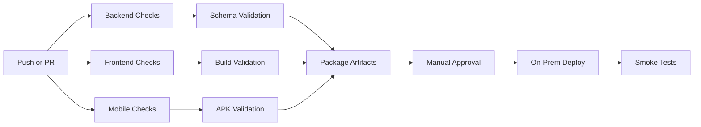

# CI/CD Pipeline

## Current repository workflows

Mavjud GitHub Actions pipeline'lar:

- `.github/workflows/backend.yml`
- `.github/workflows/frontend.yml`
- `.github/workflows/mobile.yml`
- `.github/workflows/ci.yml`
- `.github/workflows/deploy.yml`

## Current flow summary

### Backend
- Python setup
- dependency install
- lint
- migrate
- test
- schema generation

### Frontend
- Node setup
- `npm ci`
- lint
- build

### Mobile
- Flutter setup
- `flutter pub get`
- analyze
- build APK

### Deploy
- SSH deploy
- `docker compose up -d --build`
- migrate
- collectstatic

## Recommended enterprise pipeline

## Branch strategy

- `main` — production
- `develop` — integration
- `feature/*` — feature branches
- `hotfix/*` — urgent production fixes

## Recommended release gates

1. backend tests pass
2. frontend build passes
3. mobile analyze passes
4. OpenAPI schema diff reviewed
5. migrations reviewed
6. smoke test checklist signed

## On-prem deployment flow

1. merge to `main`
2. GitHub Actions deploy job triggers
3. SSH to internal server
4. pull latest code
5. rebuild compose stack
6. run migrations
7. collect static
8. smoke test health endpoints

## Recommended next improvements

- add secrets scanning
- add dependency vulnerability scan
- add artifact versioning
- add DB backup before deploy
- add rollback script
- add release notes generation
- add mobile signed release channel
