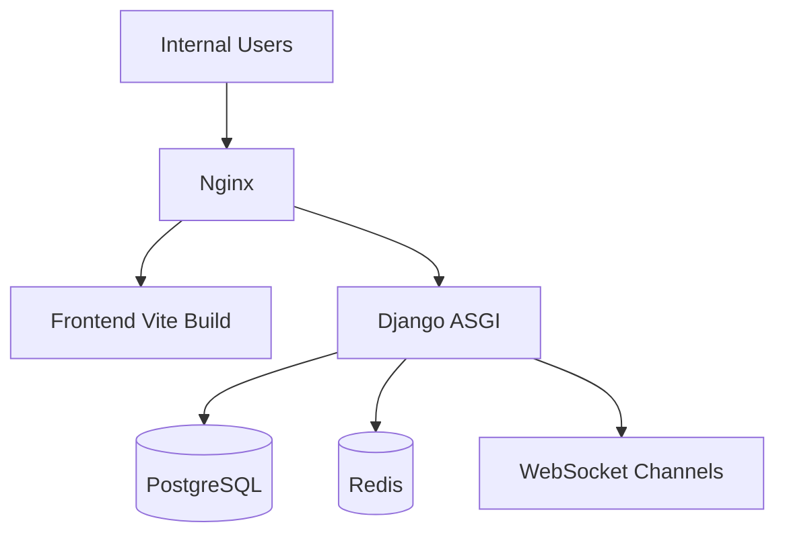
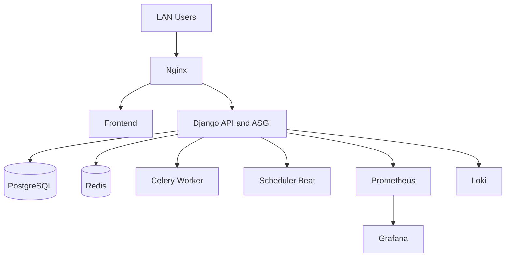

# Docker Infrastructure

## Deployment model

On-premise single-stack deployment:

- PostgreSQL
- Redis
- Django backend (ASGI)
- React frontend
- Nginx reverse proxy

Current runtime file:
- `docker-compose.yml`

## Current topology

## Target enterprise topology

## Network zones

### Internal LAN
- web access
- apk sync access
- admin access

### Service network
- db
- redis
- backend
- worker
- monitoring

### Storage
- postgres volume
- redis volume
- media volume
- static volume
- backup mount

## Service responsibilities

### `db`
- primary relational storage
- ACID transactions
- tenant data separation by row scope

### `redis`
- websocket broker
- cache store
- notification fanout
- future celery broker

### `backend`
- DRF API
- Channels websocket
- auth/rbac
- domain workflows

### `frontend`
- internal web portal
- admin / superadmin / pharmacy UX

### `nginx`
- reverse proxy
- static/media serving
- websocket upgrade forwarding
- internal TLS termination if needed

## Recommended additions

1. `celery-worker`
2. `celery-beat`
3. `prometheus`
4. `grafana`
5. `loki`
6. `backup` service or cron-driven dump container

## Backup strategy

- nightly PostgreSQL dump
- weekly encrypted full backup
- media directory incremental backup
- restore drill monthly

## Production readiness checklist

- use `.env` outside repo
- pin image versions
- mount persistent volumes
- healthchecks on all services
- nginx websocket headers enabled
- DB backup retention defined
- Prometheus alerts configured
- Grafana dashboards versioned
